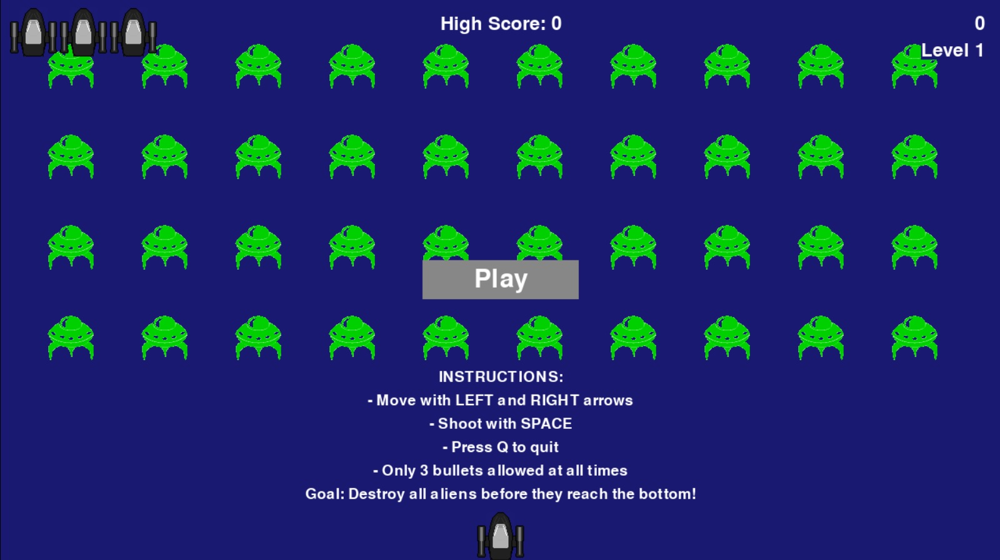
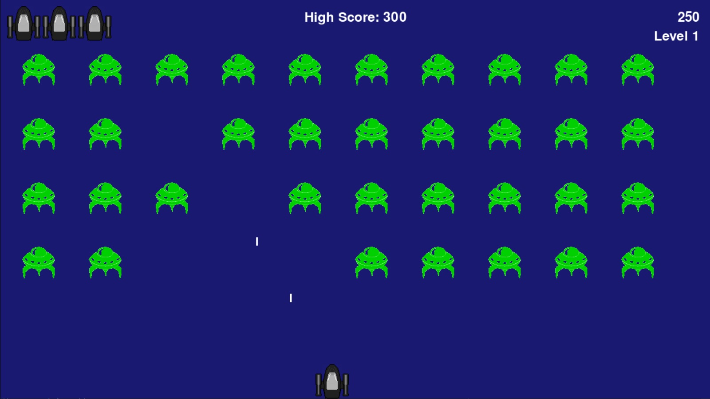

# Alien Invasion

**Objective**  
Recreate a classic-style arcade game using Python and Pygame where the player controls a ship to shoot down incoming alien fleets.

**Tools**  
- Python (`pygame`)  
- GitHub for version control and portfolio showcasing  

---

## Overview
This project is a Python-based game inspired by the classic arcade "Space Invaders."  
The player controls a ship that moves horizontally across the screen and fires bullets to destroy incoming alien fleets.  
- **What is it?** A fully functional arcade shooter game built with `pygame`.  
- **Who is it for?** Anyone learning Python or interested in retro-style games.  
- **Why is it valuable?** Demonstrates object-oriented programming (OOP), event handling, game loops, and collision detection in Python.

---

## Approach
- **Game Development Framework**: Used `pygame` for rendering graphics, handling user input, and game logic.  
- **Object-Oriented Programming**: Classes were built for Ship, Bullet, Alien, GameStats, and Button (Play/Instructions).  
- **Game Features**:  
  - Player ship that moves left/right and fires bullets.  
  - Alien fleet that moves as a group and descends gradually.  
  - Scoring system and game-over logic.  
  - Start button and instructions screen for usability.

---

## Key Features
- **Player Interaction**: Arrow keys to move, spacebar to shoot.  
- **Alien Fleet**: Automatically regenerates and speeds up as the game progresses.  
- **Scorekeeping**: Keeps track of points for each alien destroyed.  
- **Start/Instructions Buttons**: Visible before the game begins.  
- **OOP Structure**: Organized into multiple Python classes for readability and reusability.

---

## Files
| File | Description |
|------|-------------|
| `alien_invasion.py` | Main game loop and event handling |
| `settings.py` | Game configuration (speed, colors, screen size) |
| `ship.py` | Ship class (player-controlled) |
| `bullet.py` | Bullet class (projectiles fired by the ship) |
| `alien.py` | Alien class (enemy fleet) |
| `game_stats.py` | Tracks game statistics (score, lives) |
| `button.py` | Start and Instructions buttons |
| `start_screen.jpg` | Image for the start screen |
| `README.md` | Project description |
| `.gitignore` | Ignores unnecessary files for the repo (like cache) |

---

## How to Play

Follow these steps to play Alien Invasion on your computer:

1. **Install Python**  
   - Download and install Python 3 (version 3.8 or higher) from [python.org](https://www.python.org/downloads/).  
   - During installation, check the box to "Add Python to PATH" to make it accessible from the command line.  
   - Verify installation by opening a terminal (Command Prompt on Windows, Terminal on macOS/Linux) and typing:  
     ```bash
     python --version
     ```  
     You should see a version number (e.g., Python 3.13.2).

2. **Install Pygame**  
   - In your terminal, install Pygame by typing:  
     ```bash
     python -m pip install pygame
     ```  
   - This installs the Pygame library needed to run the game. If you see a message about upgrading pip, you can run:  
     ```bash
     python -m pip install --upgrade pip
     ```

3. **Install Git**  
   - Download and install Git from [git-scm.com](https://git-scm.com/download).  
   - Verify installation by typing in your terminal:  
     ```bash
     git --version
     ```  
     You should see a version number (e.g., git version 2.51.0).

4. **Clone the Repository**  
   - In your terminal, navigate to a folder where you want to store the game (e.g., Desktop):  
     ```bash
     cd Desktop
     ```  
   - Clone the game files from GitHub:  
     ```bash
     git clone https://github.com/EstebanSP23/alien_invasion.git
     ```

5. **Navigate to the Game Folder**  
   - Move into the game folder:  
     ```bash
     cd alien_invasion
     ```

6. **Run the Game**  
   - Start the game by typing:  
     ```bash
     python alien_invasion.py
     ```  
   - The game window should open. Use the arrow keys to move the ship, spacebar to shoot, and follow the on-screen instructions.

7. **Game Controls**  
   - **Left/Right Arrow Keys**: Move the ship horizontally.  
   - **Spacebar**: Fire bullets to destroy aliens.  
   - **Click Play Button**: Start the game from the start screen.  
   - **Click Instructions Button**: View game instructions.

---

## Troubleshooting
- **Error: "python: command not found"**  
  Ensure Python is installed and added to your system’s PATH. Reinstall Python and check the "Add Python to PATH" option.  
- **Error: "pygame module not found"**  
  Run `python -m pip install pygame` again to ensure Pygame is installed.  
- **Error: "start_screen.jpg not found"**  
  Verify that `start_screen.jpg` is in the `alien_invasion` folder. If missing, contact the repository owner.  
- **Other errors**  
  Note the exact error message and check the repository’s Issues page on GitHub or contact the repository owner.

---

## Key Code Example
```python
# Create a new bullet and add it to the bullets group
if event.key == pygame.K_SPACE:
    new_bullet = Bullet(self)
    self.bullets.add(new_bullet)
```

## Key Visualization


